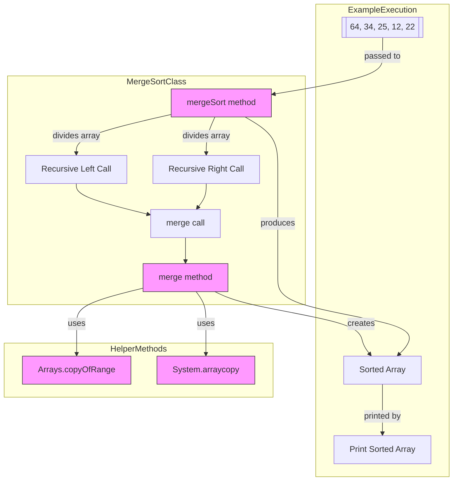

# Merge Sort Implementation in Java

Este repositório contém uma implementação em Java do algoritmo Merge Sort, 
uma técnica de ordenação do tipo dividir-e-conquistar com complexidade O(n log n).

## Como Executar
1. Compile: `javac MergeSort.java`
2. Execute: `java MergeSort`

## Diagrama do Algoritmo



## Testes
Compile e execute o arquivo de teste:
```bash
javac -cp junit.jar MergeSortTest.java
java -cp junit.jar:. org.junit.runner.JUnitCore MergeSortTest
```
